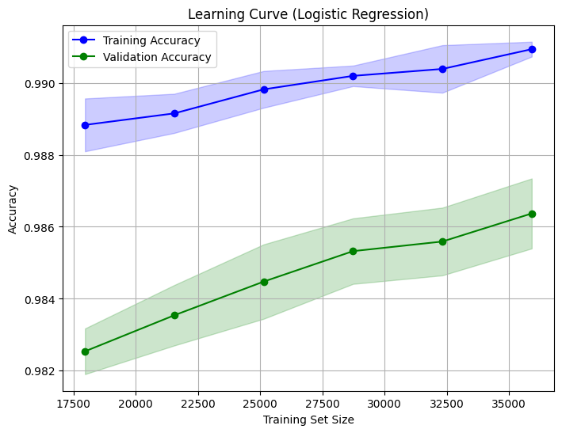
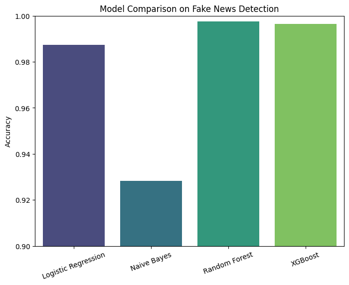

#  Fake News Detection Classifier

This project is a machine learning-based web application that detects whether a given news article is **real or fake** using Natural Language Processing (NLP) and Logistic Regression.

---

##  Features

- Input news text and predict whether it's fake or real.
- Trained on labeled news datasets.
- Clean web interface using **Streamlit**.
- Uses **TF-IDF Vectorizer** + **Logistic Regression**.

---

 Technologies Used

Data Handling: pandas, numpy

Machine Learning: scikit-learn (Logistic Regression, Naive Bayes, Random Forest)

Deep Learning : xgboost

Natural Language Processing (NLP):

scikit-learn → CountVectorizer, TfidfVectorizer

Visualization: matplotlib, seaborn

## 🧠 Model Info

- **Vectorizer**: TF-IDF
- **Model**: Logistic Regression
- **Accuracy**: ~99% (training), ~98.6% (validation)

 ## 📊 Results & Visualizations

### Learning Curve

### Model Comparison

## 📊 Model Comparison

We compared multiple models on Fake News Detection:

- Logistic Regression → 98.7%  
- Naive Bayes → 92.8%  
- Random Forest → 99.8%  
- XGBoost → 99.7%  

